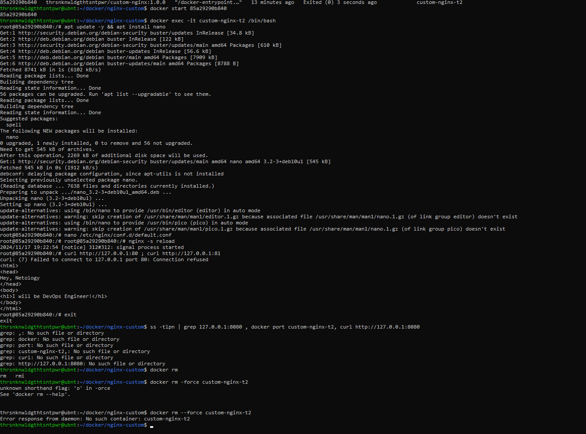

# Домашнее задание к занятию "`Защита хоста`" - `Никифоров Роман`

[Руководство по оформлению Markdown файлов](https://gist.github.com/Jekins/2bf2d0638163f1294637#Code)

---

### Задание 1 

Ознакомьтесь с инструкцией по экономии облачных ресурсов.

1) Создайте через web-интерфейс Yandex Cloud - VPC и виртуальную машину из инструкции конфигурации "эконом-ВМ" с публичным ip-адресом. В пункте "Выбор образа/загрузочного диска" выберите вкладку "Cloud Marketplace" , щелкните "Посмотреть больше", найдите образ "Yandex Cloud Toolbox".
2) Убедитесь, что вы можете подключиться к консоли ВМ через ssh, используя публичный ip-адрес. Убедитесь, что на ВМ установлен Docker с помощью команды docker --version(команду выполните от имени root пользователя) !
3) Узнайте в инструкции Яндекс, какие еще инструменты предустановлены в данном образе.
4) Оставьте ВМ работать, пока она не выключится самостоятельно! Опция "прерываемая" выключит ее не позже чем через 24 часа.
5) Для наглядности подождите еще 1 сутки.
6) Перейдите по ссылке . Выберите свой платежный аккаунт. Перейдите на вкладку детализация (фильтр "По продуктам") и оцените график потребления финансов.
7) Удалите ВМ или пользуйтесь ею при выполнении последующих домашних заданий курса обучения.

### Задание 2

Выберите один из вариантов платформы в зависимости от задачи. Здесь нет однозначно верного ответа так как все зависит от конкретных условий: финансирование, компетенции специалистов, удобство использования, надежность, требования ИБ и законодательства, фазы луны.

Тип платформы:
    физические сервера;
    паравиртуализация;
    виртуализация уровня ОС;
Задачи:
1) высоконагруженная база данных MySql, критичная к отказу;
паравиртуализация - из за простоты бэкапов и резервирования
2) различные web-приложения;
паравиртуализация - проще сделать по одной виртуальной машине на одно веб-приложение, чем делать это все на одном сервере
3) Windows-системы для использования бухгалтерским отделом;
виртуализация уровня ОС - почему бы и нет? проще развернуть, низкие требования к производительности и отказоустойчивости
4) системы, выполняющие высокопроизводительные расчёты на GPU.
физический сервер - в моей практике GPU нормально не работал в виртуализации, всегда с потерями производительности

Объясните критерии выбора платформы в каждом случае.

### Задание 3

Выберите подходящую систему управления виртуализацией для предложенного сценария. Опишите ваш выбор.

Сценарии:

1) 100 виртуальных машин на базе Linux и Windows, общие задачи, нет особых требований. Преимущественно Windows based-инфраструктура, требуется реализация программных балансировщиков нагрузки, репликации данных и автоматизированного механизма создания резервных копий.
VMWare  - самое производительное и функциональное решение
2) Требуется наиболее производительное бесплатное open source-решение для виртуализации небольшой (20-30 серверов) инфраструктуры на базе Linux и Windows виртуальных машин.
Proxmox - бесплатное, удобное, opensource
3) Необходимо бесплатное, максимально совместимое и производительное решение для виртуализации Windows-инфраструктуры.
Hyper-v - бесплатное и максимально совместимое 
4) Необходимо рабочее окружение для тестирования программного продукта на нескольких дистрибутивах Linux.
Если речь о пет-проекте и тестировании его на домашнем ПК, то либо virtualbox либо hyper-v (в том случае, если установлена ОС Windows 10 на домашнем ПК)
Если это тестирование какого-то коммерческого продукта, то я бы ставил proxmox

### Задание 4

Опишите возможные проблемы и недостатки гетерогенной среды виртуализации (использования нескольких систем управления виртуализацией одновременно) и что необходимо сделать для минимизации этих рисков и проблем. Если бы у вас был выбор, создавали бы вы гетерогенную среду или нет?

Я бы не делал гетерогенную виртуализацию, кроме случаев, когда есть необходимость поднять много Windows виртуальных машин + много Linux виртуалок и сделать это бесплатно
Если бюджет неограничен, то я бы выбирал VMWare
