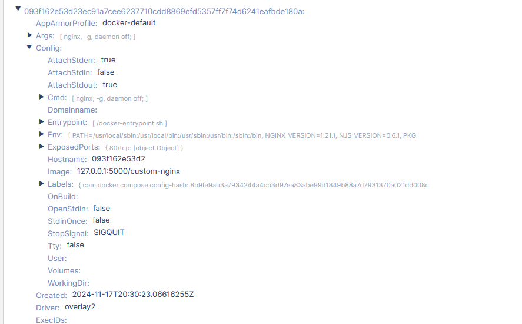
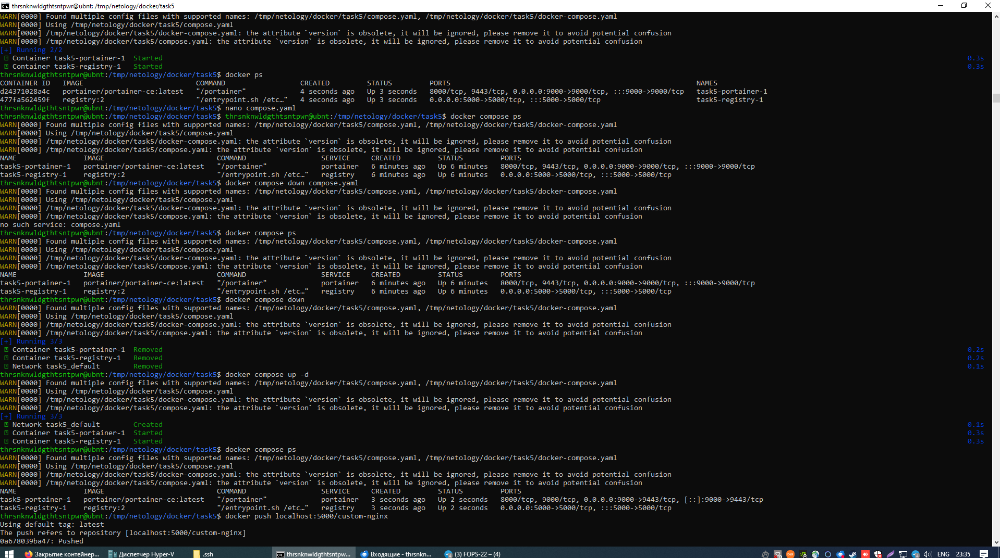

# Домашнее задание к занятию "`Очереди RabbitMQ`" - `Никифоров Роман`

[Руководство по оформлению Markdown файлов](https://gist.github.com/Jekins/2bf2d0638163f1294637#Code)

---

### Задание 1 Установка RabbitMQ

Используя Vagrant или VirtualBox, создайте виртуальную машину и установите RabbitMQ. Добавьте management plug-in и зайдите в веб-интерфейс.

Итогом выполнения домашнего задания будет приложенный скриншот веб-интерфейса RabbitMQ.


---

### Задание 2. Отправка и получение сообщений

Используя приложенные скрипты, проведите тестовую отправку и получение сообщения. Для отправки сообщений необходимо запустить скрипт producer.py.
Для работы скриптов вам необходимо установить Python версии 3 и библиотеку Pika. Также в скриптах нужно указать IP-адрес машины, на которой запущен RabbitMQ, заменив localhost на нужный IP.
$ pip install pika
Зайдите в веб-интерфейс, найдите очередь под названием hello и сделайте скриншот. После чего запустите второй скрипт consumer.py и сделайте скриншот результата выполнения скрипта
В качестве решения домашнего задания приложите оба скриншота, сделанных на этапе выполнения.
Для закрепления материала можете попробовать модифицировать скрипты, чтобы поменять название очереди и отправляемое сообщение.


---

### Задание 3. Подготовка HA кластера

Используя Vagrant или VirtualBox, создайте вторую виртуальную машину и установите RabbitMQ. Добавьте в файл hosts название и IP-адрес каждой машины, чтобы машины могли видеть друг друга по имени.

Пример содержимого hosts файла:

$ cat /etc/hosts
192.168.0.10 rmq01
192.168.0.11 rmq02

После этого ваши машины могут пинговаться по имени.

Затем объедините две машины в кластер и создайте политику ha-all на все очереди.

В качестве решения домашнего задания приложите скриншоты из веб-интерфейса с информацией о доступных нодах в кластере и включённой политикой.

Также приложите вывод команды с двух нод:

$ rabbitmqctl cluster_status

Для закрепления материала снова запустите скрипт producer.py и приложите скриншот выполнения команды на каждой из нод:

$ rabbitmqadmin get queue='hello'

После чего попробуйте отключить одну из нод, желательно ту, к которой подключались из скрипта, затем поправьте параметры подключения в скрипте consumer.py на вторую ноду и запустите его.

Приложите скриншот результата работы второго скрипта.




```
thrsnknwldgthtsntpwr@ubnt1:~$ sudo rabbitmqctl cluster_status
Cluster status of node rabbit@ubnt1 ...
Basics

Cluster name: rabbit@ubnt1

Disk Nodes

rabbit@ubnt1

Running Nodes

rabbit@ubnt1

Versions

rabbit@ubnt1: RabbitMQ 3.9.13 on Erlang 24.2.1

Maintenance status

Node: rabbit@ubnt1, status: not under maintenance

Alarms

(none)

Network Partitions

(none)

Listeners

Node: rabbit@ubnt1, interface: [::], port: 25672, protocol: clustering, purpose: inter-node and CLI tool communication
Node: rabbit@ubnt1, interface: [::], port: 5672, protocol: amqp, purpose: AMQP 0-9-1 and AMQP 1.0
Node: rabbit@ubnt1, interface: [::], port: 15672, protocol: http, purpose: HTTP API

Feature flags

Flag: drop_unroutable_metric, state: disabled
Flag: empty_basic_get_metric, state: disabled
Flag: implicit_default_bindings, state: enabled
Flag: maintenance_mode_status, state: enabled
Flag: quorum_queue, state: enabled
Flag: stream_queue, state: enabled
Flag: user_limits, state: enabled
Flag: virtual_host_metadata, state: enabled
```

```
thrsnknwldgthtsntpwr@ubnt2:~$ sudo rabbitmqctl cluster_status
Cluster status of node rabbit@ubnt2 ...
Basics

Cluster name: rabbit@ubnt2

Disk Nodes

rabbit@ubnt1
rabbit@ubnt2

Running Nodes

rabbit@ubnt1
rabbit@ubnt2

Versions

rabbit@ubnt1: RabbitMQ 3.9.13 on Erlang 24.2.1
rabbit@ubnt2: RabbitMQ 3.9.13 on Erlang 24.2.1

Maintenance status

Node: rabbit@ubnt1, status: not under maintenance
Node: rabbit@ubnt2, status: not under maintenance

Alarms

(none)

Network Partitions

(none)

Listeners

Node: rabbit@ubnt1, interface: [::], port: 25672, protocol: clustering, purpose: inter-node and CLI tool communication
Node: rabbit@ubnt1, interface: [::], port: 5672, protocol: amqp, purpose: AMQP 0-9-1 and AMQP 1.0
Node: rabbit@ubnt1, interface: [::], port: 15672, protocol: http, purpose: HTTP API
Node: rabbit@ubnt2, interface: [::], port: 25672, protocol: clustering, purpose: inter-node and CLI tool communication
Node: rabbit@ubnt2, interface: [::], port: 5672, protocol: amqp, purpose: AMQP 0-9-1 and AMQP 1.0

Feature flags

Flag: drop_unroutable_metric, state: disabled
Flag: empty_basic_get_metric, state: disabled
Flag: implicit_default_bindings, state: enabled
Flag: maintenance_mode_status, state: enabled
Flag: quorum_queue, state: enabled
Flag: stream_queue, state: enabled
Flag: user_limits, state: enabled
Flag: virtual_host_metadata, state: enabled
```




---

